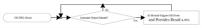
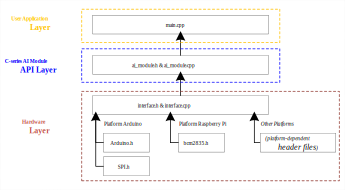
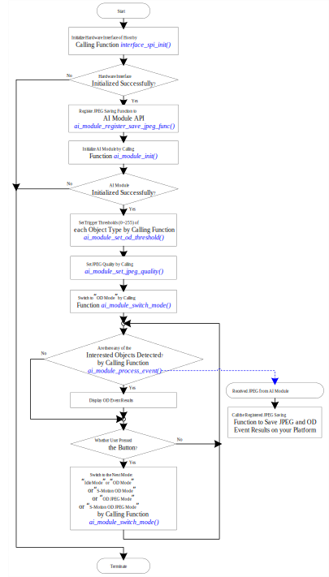

# InstAI C-Series AI Module Sample Code
This sample code demonstrates how to communicate with InstAI Compact-Series AI Module in C/C++ on your host.

Currently compatible with Raspberry Pi platform and Arduino framework.
## C-Series AI Module
InstAI C-Series AI Module provides the following object detection(OD) operation modes:
1. **Idle Mode (IDLE_MODE)**: When AI Module is in idle state, it would not provide any information to Host even when the interested objects were detected.
2. **Object Detection Mode (OD_MODE)**: When any of the interested objects were detected, interrupt event occurred, which means the OD result is ready to be retrieved from Host. <br /> 
3. **Sensor Motion Object Detection Mode (S_MOTION_OD_MODE)**: Switch to sensor motion detection state upon entering this mode. When sensor detects the difference between captured images, NPU would be powered up, started to inference the latest image and provide the OD results. When NPU has not detected any of the interested objects for more than 5 seconds, AI Module switches back to sensor motion detection state to save power consumption. <br /> 
4. **Object Detection JPEG Mode (OD_JPEG_MODE)**: When any of the interested objects were detected, AI module would not only provide OD results, but JPEG image which triggered the OD event. <br /> 
5. **Sensor Motion Object Detection JPEG Mode (S_MOTION_OD_JPEG_MODE)**: This mode is the combination of S_MOTION_OD_MODE and OD_JPEG_MODE. When there is no motion detected by sensor, AI Module powers down NPU. Otherwise, AI Module powers up NPU and started inferencing the captured images. If any of the insterested objects were detected, the OD results and the JPEG image which triggered OD event could be provided to Host. <br /> 

The OD result contains the following information:
1. Total object number detected in the latest frame.
2. The attributes of each detected object including:
   1. the object's coordinate position (center X, center Y) relative to the frame resolution (320x240 pixels)
   2. the object's size (width, height) in pixel
   3. the object's type
   4. the object's confidence level

## Sample Code File Hierarchy and Description
Here is the graph presents the file hierarchy of this sample code:



1.	**Hardware Layer (interface.h & interface.cpp)**:
    If your Host platform is either on Raspberry Pi or on Arduino, you can define either options below in the header file interface.h
    * For Raspberry Pi:
    ```C
    #define PLATFORM_RASPI
    ```
    * For Arduino
    ```C
    #define PLATFORM_ARDUINO
    ```
    * For other platforms, remove the above platform definition in the file interface.h and finish implementing the platform-dependent hardware functions in the source code interface.h and interface.cpp.

2. **C-Series AI Module API Layer (ai_module.h & ai_module.cpp)**: After finished implementing the platform-dependent APIs, ai_module.h & ai_module.cpp have the ability to access AI Module by digital pins of Host, so that user program on User Application Layer (main.cpp) can manipulate AI Module with the APIs provided by this layer.

3. **User Application Layer (main.cpp)**: The source code provides the demonstration of how your host communicates with AI Module by AI Module API Layer. When user pressed the button, AI Module will be changed to the next mode with the sequence **IDLE_MODE→OD_MODE→S_MOTION_OD_MODE→OD_JPEG_MODE→S_MOTION_OD_JPEG_MODE→IDLE_MODE**. <br /> Here is the flowchart of AI Module Application Sample Code: <br />  <br/>
    * The pin USER_BUTTON_PIN should be defined on your host and pull **LOW** when the button is not pressed:
    ```C++
    #define USER_BUTTON_PIN 4 // define the user button pin number connected to your host
    ```
    
    * When AI Module is in OD operation mode, the sample code continues calling the function `ai_module_process_event(od_event)` to detect whether any of the interested objects were detected. If none of the interested objects were detected, `ai_module_process_event(od_event)` returns `false`, and the passed parameter `od_event` would not be modified. In the other hand, if any of the interested object were detected, `ai_module_process_event(od_event)` returned `true`, and the passed parameter 'od_event' would be refreshed with the detected object(s) information. <br /> <br /> `od-event` is the variable with data-type `struct od_data_struct` defined in ai_module.h:
    ```C++
    struct od_data_struct {
      uint8_t object_num;
      uint8_t reserve;
      struct od_object_unit_struct object[MAX_OD_SUPPORT_OBJECTS];
    };
    ```
    
    The variable `object_num` in structure `od_data_struct` gives the information of how many objects were detected in the captured frame, and the variable `object` gives the attributes of each detected object. Here is the data-type `struct od_object_unit_struct` defined in ai_module.h:
    ```C++
    struct od_object_unit_struct {
      uint32_t center_x;
      uint32_t center_y;
      uint32_t width;
      uint32_t height;
      uint8_t object_type;        // object type ranges from 2 to 22
      uint8_t confidence_level;
    };
    ```
    
    Here is the object detection sample code:
    ```C++
    // detect whether there is any OD event triggered
    struct od_data_struct od_event;
    bool is_obj_detected = ai_module_process_event(&od_event); // check for register of AI Module

    // read OD information if OD event triggered
    if(is_obj_detected)
    {
      // process the OD results od_event if any interested objects were detected
    }
    ```
    
    * If Host would like to save JPEG which triggered the OD event in OD_JPEG_MODE or S_MOTION_JPEG_MODE on your platform, the file saving function with the same prototype should be implemented:
   ```C++
   void Platform_JPEG_Save(uint8_t *jpeg_data, size_t jpeg_size, struct od_data_struct *od_result)
   {
      // save JPEG file <jpeg_data> with size <jpeg_size> and OD results <od_result> on your platform
   }
   ```
      And the implemented JPEG saving function must be registered with AI Module API:
   ```C++
   ai_module_register_save_jpeg_func(Platform_JPEG_Save);
   ```
      When JPEG was received from AI Module, the API would call the registered JPEG saving function with filled parameters `jpeg_data`, `jpeg_size` and `od_result`.

## C-Series AI Module Sample Code Demo Video
Here is the demo video of operating C-Series AI Module with Arduino framework on Host ESP32 (NodeMCU-32S Development Kit)

[](http://www.youtube.com/watch?v=UdGCmzfL9Gk)
